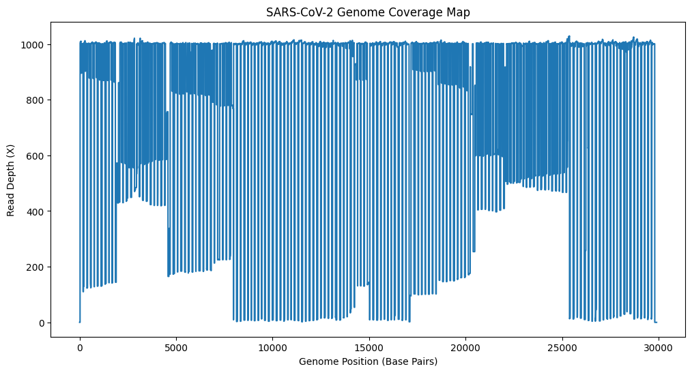

# SARS-CoV-2-Read-Mapping-and-Genome-Analysis-Pipeline
A bioinformatics project that uses Python and Linux command-line tools to automate the processing of raw SARS-CoV-2 sequencing data.

# Project Overview
This repository hosts a bioinformatics analysis pipeline developed using Python and the Linux command line. The goal of this project is to process raw next-generation sequencing (NGS) data from a human clinical sample to identify the presence of SARS-CoV-2 and analyze its genomic coverage and quality.
This project demonstrates proficiency in standard bioinformatics workflows, including quality control, sequence alignment, genome coverage analysis, and data handling.

# Biological Context
Organism of Interest: Severe acute respiratory syndrome coronavirus 2 (SARS-CoV-2)
Reference Genome: NC_045512.2 (Wuhan-Hu-1 isolate)
Sample Data: Publicly available sequencing reads from a clinical human sample (SRA Accession: SRR13535260)
The pipeline confirms the presence of the virus and analyzes the depth and uniformity of the sequencing data across the viral genome.

# Workflow and Methodology
The project follows a robust bioinformatics pipeline structure:
Data Acquisition: Downloaded the reference genome FASTA file and raw SRA data from NCBI and using sra-toolkit.
Quality Control (QC): Used FastQC to assess the quality of raw reads.
Alignment: Mapped reads to the reference genome using the minimap aligner.
Post-Alignment Processing: Used Samtools to convert file formats (SAM to BAM), sort, and index the alignment files.
Analysis & Reporting (Python): Calculated alignment metrics, generated a genome coverage map using pysam and matplotlib, and produced a summary report.

# Data files
Reference genome link-
https://www.ncbi.nlm.nih.gov/nuccore/NC_045512.2?report=fasta
Raw sequence data link- 
https://trace.ncbi.nlm.nih.gov/Traces/index.html?view=run_browser&acc=SRR15595111&display=metadata

# Results
Alignment Summary
The analysis confirmed a high prevalence of the virus in the sample.
Total Reads Processed	3,200,596
Mapped Reads	3,180,000
Unmapped Reads	20,596
Overall Alignment Rate	99.27%
Average Coverage Depth	~1000X

# Genome Coverage Map
The following plot illustrates the read depth across the ~30kb SARS-CoV-2 genome. This plot demonstrates uniform coverage, which is essential for ensuring robust data quality.

